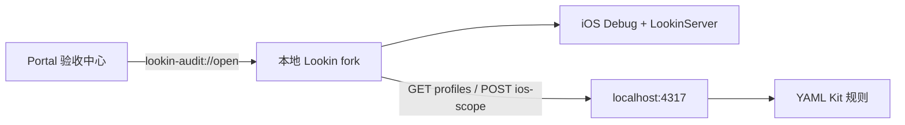

# Web 调用 Lookin MVP

## 链路

## 实现
- 在 [LookinClient_Info.plist](/Users/tiantian/Documents/ui-audit-tool/vendor/Lookin/LookinClient/LookinClient_Info.plist) 注册 `lookin-audit://`；在 [AppDelegate.m](/Users/tiantian/Documents/ui-audit-tool/vendor/Lookin/LookinClient/AppDelegate.m) 处理链接、激活应用并打开连接入口。协议只接受固定 action，忽略未知参数。
- 为 [audit/page.tsx](/Users/tiantian/Documents/ui-audit-tool/apps/design-system-portal/src/app/audit/page.tsx) 增加客户端启动区：先确认 `127.0.0.1:4317` 在线，再提示“打开 Lookin”；离线时显示 `npm run ui`，协议无法拉起时展示本地构建/打开命令。
- 在 [LKUIAuditWindowController.m](/Users/tiantian/Documents/ui-audit-tool/vendor/Lookin/LookinClient/Static/LKUIAuditWindowController.m) 每次展示验收面板时重新请求 `/api/audit/profiles`，使新增或修改的 Kit YAML 无需重编 Lookin 即可生效；保留手动选择设备、容器和 Figma Frame 的现有流程。
- 固定 fork 构建产物路径并补充本地打开脚本，更新 [build-lookin-fork.sh](/Users/tiantian/Documents/ui-audit-tool/scripts/build-lookin-fork.sh)、[package.json](/Users/tiantian/Documents/ui-audit-tool/package.json) 和 [lookin-fork.md](/Users/tiantian/Documents/ui-audit-tool/docs/lookin-fork.md)，形成“构建并打开 Lookin → 启动 4317 → 启动 Portal”的可重复步骤。

## 验证
- Portal 测试覆盖在线、离线、打开 Lookin 和回退提示。
- Lookin 测试/构建验证 URL scheme 与 Profile 刷新不破坏现有 UI Audit。
- 本机冒烟：从验收中心拉起 Lookin，连接 Debug 设备，打开 UI Audit，确认最新组件 Profile 可见并完成一次模块比较。